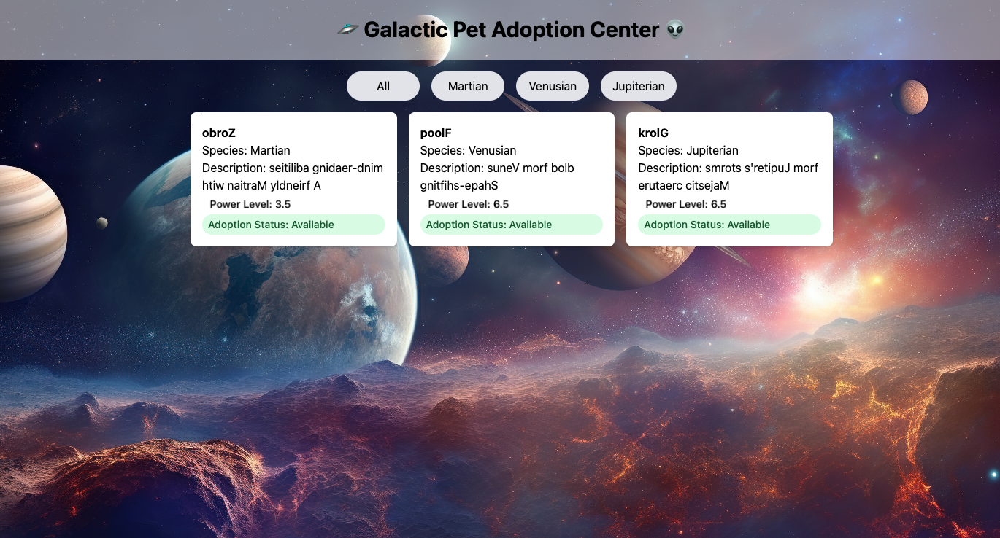

# 🐾 React Patterns: Pet Adoption Center

This project is a playful Pet Adoption Center built in React to demonstrate advanced component design patterns. It showcases real-world usage of **Component Composition**, **Context API**, **Higher Order Components (HOC)**, and **Render Props** — all wrapped in a Tailwind-styled interface.

> Built as part of FLGF24 Week 7 assignment on mastering React design patterns.

---

## 🧩 React Patterns Used

| Pattern            | Used In                         |
|--------------------|----------------------------------|
| Component Composition | `AdoptionCenter.jsx` → main layout |
| Context API        | `PetContext.js` → global state (pet list, filters, adoptions) |
| Higher Order Component (HOC) | `withGalacticTranslation.js` → decodes alien pet names |
| Render Props       | `PetPowerMeter.jsx` → flexible power display logic |

---

## 💡 Features

- View and filter galactic pets by species
- See power levels visualized using Render Props
- Translate alien pet names with a custom HOC
- Apply to adopt pets using a dynamic form
- Global state management with React Context
- Fully tested with Jest and React Testing Library

---

## 🛠️ Tech Stack

- React
- Tailwind CSS
- Context API
- Custom HOC / Render Props
- Jest + React Testing Library

---

## 🚀 Getting Started

```bash
git clone https://github.com/your-username/pet-adoption-center
cd pet-adoption-center
npm install
npm run dev
```

Run the tests:

```bash
npm test
```

---

## 📁 Project Structure

```
src/
├── components/
│   ├── AdoptionCenter.jsx
│   ├── AdoptionForm.jsx
│   ├── PetCard.jsx
│   ├── PetGallery.jsx
│   └── PetPowerMeter.jsx
├── context/
│   └── PetContext.js
├── hoc/
│   └── withGalacticTranslation.js
├── __tests__/
│   └── PetAdoption.test.jsx
```

---

## 📸 Preview



---

## ✍️ Reflection

This project was a great deep dive into React’s architectural patterns. I especially enjoyed implementing the `withGalacticTranslation` HOC to decode alien pet names — it was a fun way to explore HOC design. Render Props in the `PetPowerMeter` also taught me how to decouple logic and visualization.

---

## 👩‍💻 Author

Pamela Augustine  
